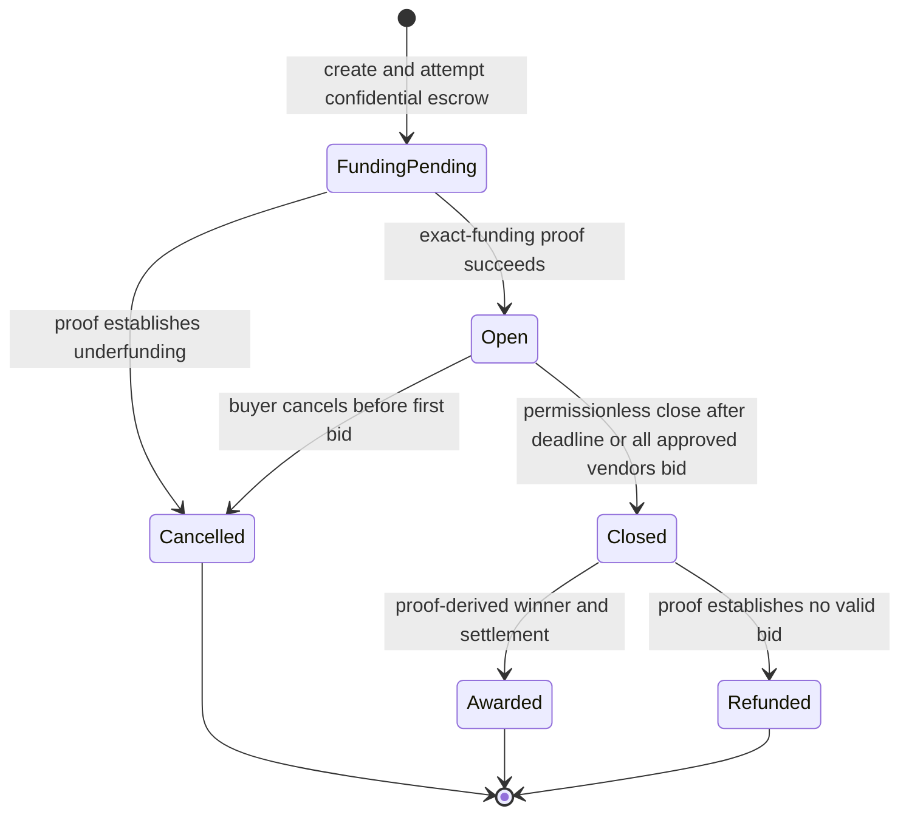
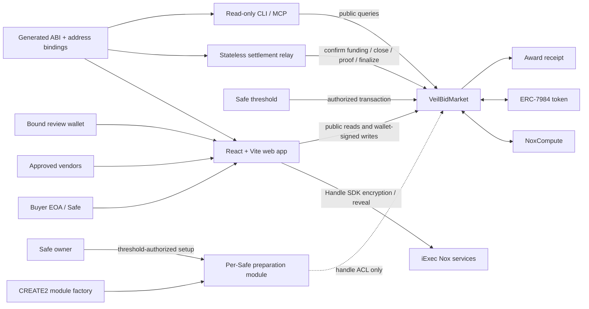

# VeilBid

[](https://github.com/huutrungle2001/Veilbid/actions/workflows/release-ci.yml)
[](https://sepolia.etherscan.io/)
[](LICENSE)

> Confidential reverse procurement for Safe treasuries, powered by iExec Nox
> and ERC-7984.

- **Live application:** [veilbid-three.vercel.app](https://veilbid-three.vercel.app)
- **Public repository:** [github.com/huutrungle2001/Veilbid](https://github.com/huutrungle2001/Veilbid)
- **Network:** Ethereum Sepolia (`11155111`)

VeilBid lets a buyer publish transparent tender rules while keeping vendor
prices and settlement values confidential. Approved vendors submit encrypted
bids, iExec Nox evaluates the lowest valid bid, and only the proof-derived
winning vendor becomes public after the deadline. A Safe treasury remains the
actual spending authority throughout the flow.

This repository contains the deployed hackathon release: Solidity contracts, a
responsive role-based web application, a stateless finalizer, read-only MCP
tools, generated chain bindings, repeatable verification, and sanitized Sepolia
evidence.

> [!WARNING]
> VeilBid is unaudited, testnet-only software. Its faucet assets have no monetary
> value. Do not use mainnet keys, production funds, or valuable treasury assets.

## Table of contents

- [Why VeilBid](#why-veilbid)
- [Verified release](#verified-release)
- [Quick start](#quick-start)
- [Quick judge path](#quick-judge-path)
- [How it works](#how-it-works)
- [Architecture](#architecture)
- [Privacy and trust boundaries](#privacy-and-trust-boundaries)
- [User workflows](#user-workflows)
- [Run locally](#run-locally)
- [Configuration](#configuration)
- [Testing and verification](#testing-and-verification)
- [Automation and MCP](#automation-and-mcp)
- [Repository structure](#repository-structure)
- [Known limitations](#known-limitations)
- [Documentation](#documentation)

## Why VeilBid

Public procurement leaks commercial information. When bids are posted in
plaintext, later vendors can copy, undercut, or coordinate around earlier
offers. A fully private off-chain process avoids that leak, but provides weak
public settlement guarantees and limited auditability.

VeilBid combines:

- Public tender metadata, ceiling, vendor allowlist, deadline, and lifecycle.
- Encrypted vendor prices with no plaintext bid ledger.
- Nox-based encrypted validity checks and lowest-price selection.
- Public proof verification for the winning bid identifier.
- Confidential ERC-7984 payment and buyer remainder.
- Safe threshold authority for treasury actions.
- Per-bid vendor disclosure plus automatic post-finalization review access.
- A non-transferable award receipt for the public winner.
- Permissionless, recoverable close and finalization.

The core rule is simple: **the client never supplies a plaintext winner**.
Finalization accepts only a public-decryption proof for the encrypted winner ID
stored by the market.

## Verified release

The canonical release manifest is
[`packages/contracts/deployments/sepolia.release.json`](packages/contracts/deployments/sepolia.release.json).
It records `verified: true`, deployment transactions, blocks, Safe
configuration, and canonical addresses.

| Component | Ethereum Sepolia address |
|---|---|
| VeilBid Market | [`0x720ac8Ae5dE78590FF5184E53130460033228afc`](https://sepolia.etherscan.io/address/0x720ac8Ae5dE78590FF5184E53130460033228afc) |
| Confidential ERC-7984 test token | [`0xE55b2f4630E9b1d48C7Fd8001527BA5dCD9192b1`](https://sepolia.etherscan.io/address/0xE55b2f4630E9b1d48C7Fd8001527BA5dCD9192b1) |
| Faucet test USDC | [`0xeE9A2B02C8700596b4814923c4086786c63A9D01`](https://sepolia.etherscan.io/address/0xeE9A2B02C8700596b4814923c4086786c63A9D01) |
| Non-transferable award receipt | [`0x7B51DE3579F61741eDA8602D79AAD3f175451656`](https://sepolia.etherscan.io/address/0x7B51DE3579F61741eDA8602D79AAD3f175451656) |
| Demo Safe 1.4.1 | [`0xBF39C8C9C196f1a06bB122abea350eC63AB3fbA0`](https://sepolia.etherscan.io/address/0xBF39C8C9C196f1a06bB122abea350eC63AB3fbA0) |
| Safe preparation module | [`0x60a3ed162b13E7Fd8b0139547Aa1B38F41a774C0`](https://sepolia.etherscan.io/address/0x60a3ed162b13E7Fd8b0139547Aa1B38F41a774C0) |
| Per-Safe module factory | [`0x6C09f72FF67eE0bfAD7D45DFFde5bd06228050BE`](https://sepolia.etherscan.io/address/0x6C09f72FF67eE0bfAD7D45DFFde5bd06228050BE) |
| Safe unwrap preparation adapter | [`0x779bacA165500e34aF65BF01AF4C2F2a997C9ff9`](https://sepolia.etherscan.io/address/0x779bacA165500e34aF65BF01AF4C2F2a997C9ff9) |

The release has completed a real two-vendor Safe-funded lifecycle on Sepolia.
The winner was selected through Nox computation and a public winner proof;
confidential payment conservation was asserted in memory and excluded from
committed output.

Key public evidence:

- [Canonical two-vendor lifecycle](evidence/sepolia/release-two-vendor.json)
- [Release deployment consistency](evidence/sepolia/deployment-consistency.release.json)
- [Source publication mapping](evidence/sepolia/source-publication.release.json)
- [Production frontend smoke](evidence/sepolia/production-smoke.json)
- [Production keyboard verification](evidence/sepolia/production-keyboard.json)
- [Sanitized evidence policy and ledger](docs/verification.md)

## Quick start

Requires Git, Node.js `>=24 <25`, and Corepack. Clone the repository, install
the pinned dependencies, and start the web application:

```bash
git clone https://github.com/huutrungle2001/Veilbid.git
cd Veilbid
corepack enable
corepack pnpm install --frozen-lockfile
corepack pnpm --filter @veilbid/tender-room dev --host 0.0.0.0
```

Open [http://localhost:5173](http://localhost:5173). The landing page,
documentation, and public tender views work without a wallet. Sepolia write
flows require an injected browser wallet; never enter a private key in the web
application.

For environment variables, production builds, and optional local Nox testing,
continue to [Run locally](#run-locally). See the [User guide](docs/user-guide.md)
for role-by-role usage and the [Deployment guide](docs/deployment.md) for
release operations.

## Quick judge path

No wallet is required for the public path:

1. Open the [Tender Room](https://veilbid-three.vercel.app/room).
2. Open finalized tender `#1`.
3. Inspect the public buyer, approved vendors, ceiling, deadline, status,
   proof-derived winner, transaction links, and award receipt.
4. Confirm that no winning or losing bid value appears in the public dossier.
5. Open [Docs](https://veilbid-three.vercel.app/docs) for the role-by-role flow.
6. Compare the UI result with the
   [two-vendor lifecycle evidence](evidence/sepolia/release-two-vendor.json).
7. Review the [threat model](docs/threat-model.md) before evaluating privacy or
   security claims.

## How it works

### Tender lifecycle



### Selection and settlement

1. The buyer fixes a public ceiling, future deadline, metadata hash, payment
   token, and one to eight unique approved vendor addresses.
2. Safe Buyer discovers any Sepolia Safe owned by the connected wallet. A
   one-time threshold-authorized batch deploys/enables that Safe's deterministic
   preparation module and configures settlement authority.
3. The connected owner wallet can approve and wrap its public test vUSDC
   directly to the selected Safe. Tender creation then prepares the Nox funding
   handle and creates the tender atomically through the Safe threshold.
4. A public equality proof must establish that encrypted escrow equals the
   public ceiling before the tender becomes `Open`.
5. Each approved vendor may submit one immutable encrypted price.
6. Nox checks whether the bid is nonzero and within the ceiling. Invalid bids
   become an encrypted sentinel rather than revealing why they are invalid.
7. `Nox.lt` and `Nox.select` update the encrypted best-price and winner-ID
   accumulators together. Equal valid bids preserve first-submission priority.
8. After the deadline, or immediately once every approved vendor has submitted,
   anyone may call `closeTender`. Only the encrypted winner ID becomes publicly
   decryptable.
9. A Nox public-decryption proof binds the result to the stored winner handle.
   `finalizeTender` maps the proven bid ID to its stored vendor.
10. The winner receives the confidential bid amount, while the buyer receives
   the confidential remainder. A zero winner produces a full confidential
   refund.
11. An awarded tender mints one non-transferable receipt to the stored winning
    vendor.

There is no timeout refund after close. If proof infrastructure is temporarily
unavailable, the tender remains recoverable in `Closed` rather than allowing
the buyer to invalidate a legitimate award.

## Architecture



### On-chain components

- **VeilBidMarket:** tender lifecycle, internal escrow custody, encrypted bid
  import, encrypted argmin, proof verification, settlement, and viewer ACL.
- **VeilBidSafePreparationModule:** imports a Safe-owner input bound to the
  chain, Safe, module, market action, consumer, and one-time nonce. It has no
  Safe execution function and cannot move treasury funds.
- **VeilBidAwardReceipt:** immutable, non-transferable ERC-721 award record.
- **VeilBidTestUSDC / VeilBidConfidentialUSDC:** faucet-backed demonstration
  asset and official ERC-7984 wrapper extension.

### Off-chain components

- **Web application:** public explorer plus Buyer (Safe Buyer/EOA Buyer),
  Private Bids (Submit Bid/My Bid/Granted Access), and Activity workspaces.
- **Settlement relay:** stateless public readiness discovery and bounded
  close/finalize automation.
- **Operator console:** five strict-schema, read-only public query tools exposed
  through local CLI/MCP.
- **Chain bindings:** generated ABIs, verified addresses, event decoders,
  lifecycle indexing, and readiness rules.

Ethereum Sepolia contracts are canonical for lifecycle and settlement. There is
no application database or authentication server.

## Privacy and trust boundaries

### Confidential by default

- Vendor bid prices.
- Encrypted validity and lowest-price comparison results.
- Encrypted best-price accumulator.
- Confidential escrow, winner payment, and buyer remainder values.
- Bid plaintext revealed only to the vendor or an explicit per-handle viewer.

### Public by design

- Tender ID, buyer, metadata hash, payment token, and public ceiling.
- Approved vendor addresses, bidder addresses, bid count, and timing.
- Deadline, lifecycle status, transaction hashes, and blocks.
- Winning vendor after proof finalization.
- Award receipt ownership.
- Encrypted handles on-chain, although their underlying values remain private.

### Trust assumptions

- Wallets and browsers can observe a value before encryption or after an
  authorized reveal.
- Nox gateway, KMS, runner, indexer, and confidential runtime are within the
  confidentiality and computation boundary.
- Smart contracts enforce lifecycle, proof binding, ACL, and settlement rules,
  but remain unaudited.
- RPC providers can delay or misreport reads but cannot sign wallet
  transactions.
- Permissionless finalizers can choose timing and spend their own gas; they
  cannot choose the winner or decrypt bids.
- A Safe preparation module can prepare scoped handles, but only a normal Safe
  transaction satisfying the configured threshold can spend Safe-owned funds.

VeilBid does **not** claim anonymous bidders, hidden metadata or timing,
service-quality verification, collusion resistance, MEV elimination, formal
security, or mainnet readiness.

## User workflows

### Public observer

1. Open `/room` without connecting a wallet.
2. Select a tender and inspect public lifecycle data.
3. Follow transaction and address links to Sepolia.
4. Refresh to rebuild confirmed public state through the latest mined block.
   Records inside the 12-block finality window are labeled as pending finality;
   missing RPC/indexer data is shown as unavailable with no mock fallback.

### Buyer — direct wallet or Safe

1. Open `BUYER`, choose `EOA BUYER` for a direct wallet or `SAFE BUYER` for a
   Safe treasury, then select `CONNECT WALLET` and choose an injected
   EIP-6963 wallet. VeilBid requests the network switch automatically when
   needed; the wallet may still show separate security confirmations.
2. Enter public metadata, a ceiling, a future deadline, and one to eight vendor
   addresses.
3. Inspect Sepolia ETH and test USDC in the workspace balance panel. Use
   `GET TEST USDC` when needed. For an explicit test, open `WRAP TO vcUSDC`,
   enter an amount, and confirm the ERC-20 approval and wrap transactions.
   EOA tender creation never calls the faucet automatically: Test USDC must
   already cover the public ceiling, after which the guided flow wraps exactly
   that ceiling.
4. Authorize the market operator and create the funded tender.
5. Request and submit the public exact-funding proof.
6. Confirm the tender changes from `FundingPending` to `Open`.
7. Monitor public bid count without receiving automatic access to bid prices.
8. Close after the deadline, or as soon as every approved vendor has bid; a
   permissionless settlement relay can perform the write.
9. Resume an interrupted proof request from Activity.
10. After proof-derived finalization, use the same EOA as the automatically
    authorized review wallet; it receives no cross-bid access while `Open`.

Long-running wallet actions update a bottom-right notification instead of
appearing idle. The same notification advances through the operation’s actual
validation, encryption or simulation, wallet-signature, confirmation, and
success/error stages. Loading notifications persist; completed and failed
notifications can be dismissed and also close automatically.

The sidebar balance panel belongs to the connected EOA. After wrapping, its
vcUSDC state changes to `ENCRYPTED`; selecting the eye asks that wallet to
decrypt the balance for the current browser session only.

The same panel supports full or custom vcUSDC unwrap back to public Test USDC.
Full consumes the current encrypted balance without a private reveal; custom
requires the session balance first so the browser can reject an overdraw. The
unwrap request burns confidential funds, then a second permissionless
public-proof transaction releases Test USDC to the connected wallet. The
finalized amount and recipient become public.

Safe Buyer keeps the selected treasury focused on VeilBid's confidential asset:
the compact `SAFE FUNDS` section shows vcUSDC beside one private-view control.
The first reveal threshold-authorizes the connected owner for the current
balance handle; the next click decrypts it for this browser session. The grant
is per-handle and must be repeated after the balance changes. Revealed values
are never stored in logs, URLs, local storage, or evidence.

The same card provides an explicit vcUSDC exit without becoming a general Safe
asset manager. Its single amount field supports a `FULL` shortcut that consumes
the current encrypted balance directly without reveal. Entering a custom amount
first requires the owner to reveal the current balance in the browser, then
encrypts only that chosen amount for a dedicated preparation adapter. The
adapter validates the owner proof, current balance handle, and fresh nonce
inside the same threshold-authorized Safe batch as the wrapper call. A second
permissionless transaction finalizes the public proof; that finalization makes
the unwrapped amount and connected-wallet recipient public.

Public ETH and vUSDC are intentionally omitted from the VeilBid Safe surface.
They remain visible and transferable in the standard Safe Wallet; VeilBid does
not duplicate general-purpose treasury management.

### Private Bids — vendor and reviewer

1. Connect an address included in the tender’s public vendor allowlist.
2. Verify the ceiling, deadline, buyer, and admission status.
3. Enter the price locally in the active browser session.
4. Encrypt it for the exact chain, market, tender, and vendor.
5. Simulate, sign once, and wait for confirmation.
6. Confirm the public bid count changed while the price remained absent.
7. Reveal the vendor’s own bid when required, or grant a viewer to that one
   handle.

Each approved vendor has one immutable bid slot. There is no edit path.
The same workspace lets a tender's public review wallet check ACL and reveal
stored bids after finalization. The value remains session-only.

### Activity / finalizer

1. Close an eligible tender after the deadline.
2. Request public decryption for the winner ID only.
3. Resume the public checkpoint if indexing or proof generation is delayed.
4. Finalize once the proof is available.
5. Confirm either `Awarded` with a receipt or `Refunded` for the zero-winner
   outcome.
6. Use `LIFECYCLE HISTORY` for the indexed public event timeline and
   transaction links; confidential values and Safe signature payloads remain
   outside this public history.

### Safe treasury

1. Connect a Sepolia Safe owner and select a discovered Safe or paste its
   address.
2. Obtain public test vUSDC in the connected wallet, enter an amount under
   `SAFE FUNDS`, and approve/wrap it directly into the selected Safe.
3. Use the eye beside vcUSDC to threshold-authorize and privately reveal the
   current Safe balance handle when needed.
4. To exit vcUSDC, use the amount field after reveal or press its `FULL`
   shortcut without reveal. Public vUSDC is fixed to the connected wallet;
   satisfy the Safe threshold, then finalize the public unwrap proof.
5. In `CREATE A SAFE-OWNED TENDER`, approve the one-time setup proposal if the
   selected Safe is not ready. This deploys/enables its deterministic module,
   binds the Market, and authorizes settlement.
6. Enter public terms; VeilBid allocates the internal nonce and creates one
   atomic preparation/tender batch. The connected owner is bound in that same
   threshold-approved calldata as the public review wallet.
7. Satisfy the Safe's normal threshold. Pending multisig approvals remain
   actionable; executed actions move into collapsed transaction history.
8. After proof-derived finalization, the bound review wallet receives scoped
   access to every stored bid automatically; no extra Safe proposal is needed.

Preparation is not execution. The module contains no
`execTransactionFromModule` or arbitrary-call path.
Review access does not grant token operator, buyer, vendor, Safe signer, or
protocol-administrator authority. Do not capture revealed values in public
screenshots, logs, or evidence.

## Run locally

### Prerequisites

- Node.js `>=24 <25` (CI uses `24.18.0`)
- pnpm `10.33.0` through Corepack
- Git
- An injected browser wallet for write flows
- Sepolia ETH in each wallet that will sign transactions
- Docker only if you explicitly want the optional local Nox runtime suite

### Install

```bash
git clone https://github.com/huutrungle2001/Veilbid.git
cd Veilbid
corepack enable
corepack pnpm install --frozen-lockfile
```

### Start the web application

```bash
corepack pnpm --filter @veilbid/tender-room dev --host 0.0.0.0
```

Open [http://localhost:5173](http://localhost:5173).

Landing and documentation routes work without a wallet. Public tender reads use
the canonical Sepolia release. Browser write flows use the selected injected
wallet; never paste a private key into the web application.

### Production build

```bash
corepack pnpm build
```

The web bundle is written to `apps/web/dist`.

## Configuration

Copy the template only when running repository scripts that need an RPC or
signer:

```bash
cp .env.example .env.local
```

```dotenv
SEPOLIA_RPC_URL=https://your-sepolia-rpc.example
SEPOLIA_PRIVATE_KEY=0xyour_test_wallet_private_key
SEPOLIA_VENDOR_PRIVATE_KEY=0xoptional_secondary_test_wallet_private_key
FINALIZER_PRIVATE_KEY=0xdedicated_gas_funded_test_wallet_private_key
FINALIZER_ACTION_BUDGET=3
FINALIZER_POLL_INTERVAL_MS=30000
FINALIZER_PROOF_ATTEMPTS=3
FINALIZER_PROOF_DELAY_MS=5000
FINALIZER_HEALTH_HOST=127.0.0.1
FINALIZER_HEALTH_PORT=8787
VEILBID_ALLOW_UNVERIFIED_DEPLOYMENT=false
```

Rules:

- `.env.local` is ignored and must never be committed.
- Use disposable, testnet-only keys with no real assets.
- Browser wallet actions do not require or read CLI private keys.
- `dry-run` and `health` require only `SEPOLIA_RPC_URL`.
- `once` and `poll` require a dedicated gas-funded
  `FINALIZER_PRIVATE_KEY`.
- Keep `VEILBID_ALLOW_UNVERIFIED_DEPLOYMENT=false` for the canonical release.
- Do not print keys, plaintext bids, confidential balances, handles, proofs, or
  signatures into logs.

## Testing and verification

### Standard release checks

```bash
corepack pnpm install --frozen-lockfile
corepack pnpm test
corepack pnpm lint
corepack pnpm build
corepack pnpm bindings:check
corepack pnpm docs:check
corepack pnpm secret:scan
corepack pnpm evidence:validate
```

| Command | Purpose |
|---|---|
| `pnpm compile` | Compile production and retained feasibility Solidity with the pinned Hardhat/Nox toolchain |
| `pnpm test` | Run contract, bindings, web, relay, console, and deterministic feasibility tests |
| `pnpm test:contracts` | Run production contract and deterministic feasibility checks |
| `pnpm test:ui` | Run web wallet, form, routing, recovery, disclosure, and Safe tests |
| `pnpm lint` | Type-check application workspaces and validate browser smoke scripts |
| `pnpm build` | Compile contracts, check generated bindings, and build all runtime workspaces |
| `pnpm bindings:check` | Fail if generated ABIs or deployment snapshots drift |
| `pnpm docs:check` | Fail if canonical addresses, required public docs, relative links, or placeholders drift |
| `pnpm verify:deployment:release` | Verify canonical receipts, runtime bytecode, wiring, Safe state, and source mapping |
| `pnpm secret:scan` | Scan tracked source and full Git history for forbidden credential patterns |
| `pnpm evidence:validate` | Validate committed evidence against public-safe schemas |

### Production browser smoke

```bash
corepack pnpm test:production https://veilbid-three.vercel.app
corepack pnpm test:keyboard https://veilbid-three.vercel.app
```

Connected-wallet Buyer, Vendor, recovery, and authorized-reveal flows have also
been tested manually against the canonical Sepolia release. These checks require
explicit wallet selection and user-approved signatures; release CI never stores
wallet credentials or signs transactions.

### Nox and Sepolia suites

The Docker-backed local Nox suite is optional:

```bash
corepack pnpm test:nox
```

Real confidential-runtime evidence is Sepolia-first. Live scripts can spend
test ETH, create persistent chain state, and require the correct disposable
wallet configuration:

```bash
corepack pnpm test:sepolia:a
corepack pnpm test:sepolia:b
corepack pnpm test:sepolia:c
corepack pnpm test:sepolia:d
corepack pnpm test:sepolia:e:safe
corepack pnpm test:sepolia:e:authority
corepack pnpm test:sepolia:market:eoa
corepack pnpm test:sepolia:market:refund
corepack pnpm test:sepolia:market:safe
corepack pnpm test:sepolia:market:safe-viewer
corepack pnpm test:sepolia:release:two-vendor
```

Do not rerun live deployment or lifecycle commands merely to verify the
repository. Prefer the read-only deployment check and committed evidence unless
new chain state is intentionally required.

## Automation and MCP

### Settlement relay

```bash
corepack pnpm finalizer:health
corepack pnpm finalizer:dry
corepack pnpm finalizer:once
corepack pnpm finalizer:poll
```

- `health`: public configuration and liveness inspection.
- `dry`: rebuild finalized state and plan actions without signing.
- `once`: execute at most the configured shared action budget.
- `poll`: repeat bounded planning/execution and expose `GET /health`.

The continuously running Railway deployment is available at
[`veilbid-relay-production.up.railway.app`](https://veilbid-relay-production.up.railway.app/health).
Its `/live` endpoint reports process liveness, while `/health` verifies the
Sepolia chain ID, canonical Market bytecode, and verified release manifest.
The root [`railway.json`](railway.json) limits the build to shared bindings and
the relay, then runs polling with an always-restart policy.

The relay has no database or private reveal path. It processes actions
sequentially, rereads canonical state before writes, and logs only allowlisted
public fields.

### Read-only MCP server

```bash
corepack pnpm mcp
```

The stdio server exposes exactly five tools:

- `list_tenders`
- `get_tender`
- `explain_tender_readiness`
- `inspect_settlement_evidence`
- `inspect_bid_viewer`

It has no signer, transaction, custody, handle-return, or decryption
implementation. Standard output is reserved for MCP JSON-RPC.

## Repository structure

```text
Veilbid/
├── apps/
│   ├── web/                 # Landing, Docs, Public, EOA/Safe Buyer, Private Bids, Activity
│   ├── relay/               # Stateless close/proof/finalize automation
│   └── console/             # Read-only local CLI and MCP stdio tools
├── packages/
│   ├── contracts/
│   │   ├── contracts/       # Production and isolated feasibility Solidity
│   │   ├── test/            # Unit, property, static, feasibility, and Sepolia suites
│   │   ├── deployments/     # Canonical release and historical test manifests
│   │   ├── scripts/         # Binding, preflight, deploy, and source publication
│   │   └── verify/          # Read-only deployment consistency checks
│   └── chain-bindings/      # Generated ABI/address snapshots and public index
├── tooling/scripts/         # Preflight, secret scan, and evidence validation
├── evidence/                # Sanitized local and Sepolia verification output
├── docs/                    # User, deployment, architecture, contract, security, and verification docs
├── AGENTS.md                # Contributor and agent rules
├── DESIGNS.md               # Canonical visual and interaction system
├── SECURITY.md              # Vulnerability reporting and supported scope
└── feedback.md              # Evidence-based sponsor feedback
```

Production and feasibility Solidity share one pinned toolchain in
`packages/contracts`, but remain separate source, test, deployment, and evidence
boundaries. Feasibility contracts are never production deployment inputs or
consumer artifact sources.

See [Repository Layout](docs/repository-layout.md) for ownership and dependency
rules.

## Known limitations

- Ethereum Sepolia only; test assets have no real value.
- Contracts are unaudited and not production-ready.
- Vendor identity, participation, transaction graph, metadata, and timing are
  public.
- Nox infrastructure is part of the confidentiality, correctness, and
  availability boundary.
- A Nox proof outage can keep a closed escrow locked until recovery; there is no
  timeout-refund escape after close.
- Per-handle viewer grants are irreversible for the current handle; the bound
  review wallet receives them only after terminal finalization.
- The public index has deterministic rebuild and deduplication coverage, but a
  full live reorg rollback test remains pending.
- Contract callback protections are statically and structurally tested; a
  dedicated adversarial callback runtime test remains pending.
- Relay-originated close/finalize writes are verified on the canonical Sepolia
  release with sanitized public lifecycle evidence.
- VeilBid does not verify vendor service quality, legal performance, identity,
  reputation, collusion, bribery, or transaction ordering.

## Documentation

| Topic | Canonical document |
|---|---|
| Setup, roles, and recovery | [User Guide](docs/user-guide.md) |
| Web, relay, and contract deployment | [Deployment Guide](docs/deployment.md) |
| Product scope, roles, and acceptance criteria | [Product Plan](docs/product-plan.md) |
| Feasibility gates and kill criteria | [Feasibility Plan](docs/feasibility-plan.md) |
| System design and trust boundaries | [Architecture](docs/architecture.md) |
| Repository ownership and dependencies | [Repository Layout](docs/repository-layout.md) |
| Tender state machine and contract behavior | [Contract Specification](docs/contract-spec.md) |
| Security objectives and residual risks | [Threat Model](docs/threat-model.md) |
| Implementation milestones | [Build Plan](docs/build-plan.md) |
| Test matrix and evidence ledger | [Verification](docs/verification.md) |
| UI design and accessibility rules | [DESIGNS.md](DESIGNS.md) |

Contributors and automated agents must read [AGENTS.md](AGENTS.md) before making
changes. Architecture, deployment, security, and evidence changes must keep the
canonical documents synchronized.

## License

VeilBid is released under the [MIT License](LICENSE).
