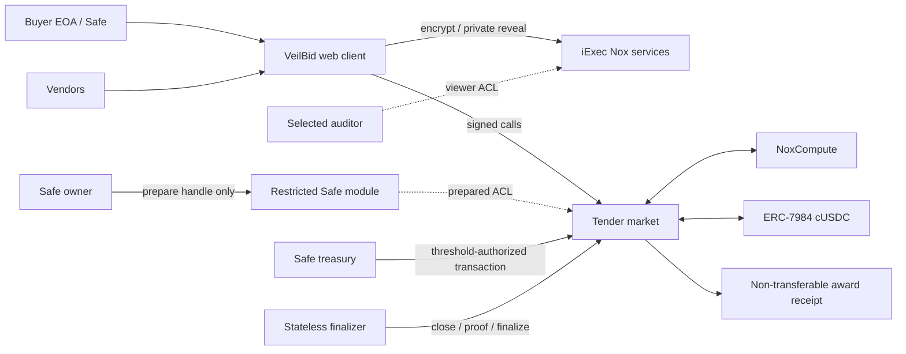

# VeilBid

> Status: Canonical Ethereum Sepolia contracts, two-vendor release lifecycle,
> and Vercel frontend are deployed and verified.

Live app: [veilbid-three.vercel.app](https://veilbid-three.vercel.app)

VeilBid is a confidential reverse-procurement protocol for DAO and Safe
treasuries. A buyer publishes a tender and public spending ceiling, vendors
submit encrypted prices, and iExec Nox selects the best valid bid without
revealing bid values on-chain. After the deadline, only the winning bid identity
is publicly decrypted and verified; settlement remains confidential through
ERC-7984.

## One-sentence differentiator

VeilBid lets a Safe treasury award and pay a competitive vendor without exposing
the vendors' prices to competitors or public chain observers.

## End-to-end flow

1. A buyer or Safe creates a tender and escrows confidential test cUSDC.
2. Vendors encrypt prices with the Nox Handle SDK and submit handles plus proofs.
3. The protocol maintains an encrypted best price and encrypted winner ID.
4. After the deadline, a permissionless caller closes the tender.
5. The winner ID is publicly decrypted with a proof verified on-chain.
6. The winner receives the encrypted winning amount; the buyer receives the
   encrypted remainder.
7. The buyer can selectively authorize an auditor to reveal individual bid terms.

## Architecture



The implementation includes a responsive web client, Solidity protocol,
preparation-only Safe module, stateless finalizer, event-derived public index,
selective audit, non-transferable award receipts, generated client artifacts,
optional read-only MCP adapter, CI, and repeatable Sepolia verification. See
`docs/architecture.md`.

## Privacy boundary

Planned confidential values:

- Vendor bid prices.
- Encrypted best-price accumulator.
- Confidential buyer escrow and winner payment handles.
- Bid values revealed only to authorized buyer/vendor/auditor accounts.

Planned public values:

- Tender description and identifier.
- Buyer and bidder addresses.
- Token, public ceiling, deadlines, status, and number of bids.
- Winning vendor after finalization.
- Transaction hashes, events, and receipt identifiers.

VeilBid does not promise bidder anonymity, hidden timing, service-delivery
verification, zero collusion, or production-grade economic security.

## Build and verify

```bash
pnpm install --frozen-lockfile
pnpm test
pnpm lint
pnpm build
pnpm test:production https://veilbid-three.vercel.app
```

Write-enabled Sepolia commands require the documented local environment. Never
commit `.env.local`; see `docs/verification.md` for sanitized evidence and
release-specific commands.

## Canonical documents

| Topic | File |
|---|---|
| Current status | `PLAN.md` |
| Product and scope | `docs/product-plan.md` |
| Technical kill criteria | `docs/feasibility-plan.md` |
| Architecture | `docs/architecture.md` |
| Repository boundaries | `docs/repository-layout.md` |
| Contract state machine | `docs/contract-spec.md` |
| Security and privacy | `docs/threat-model.md` |
| Build sequence | `docs/build-plan.md` |
| Evidence and testing | `docs/verification.md` |
| Submission | `docs/demo-and-submission.md` |

## License

MIT.
