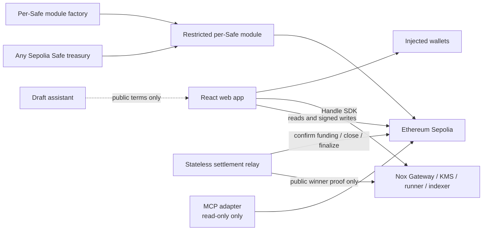
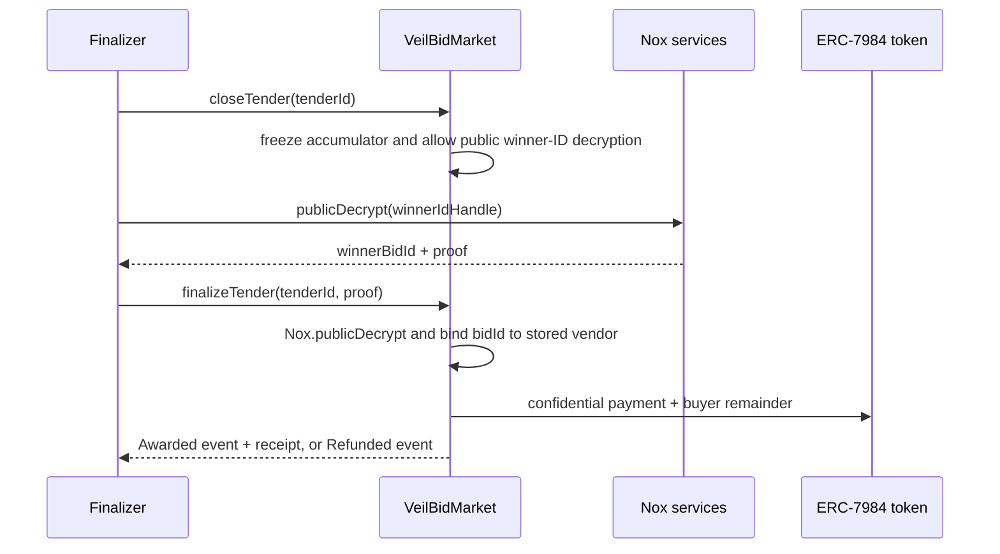

# VeilBid Architecture

> Status: Implemented release architecture. Canonical Ethereum Sepolia
> addresses are recorded in
> `packages/contracts/deployments/sepolia.release.json`.

## 1. Architecture goals

- Achieve production-grade depth through independently designed contracts,
  applications, trust boundaries, recovery paths, and verification.
- Keep Nox in the decision and settlement path.
- Keep Safe as treasury owner and signing authority.
- Make public automation permissionless and stateless.
- Derive public application state from chain events.
- Provide private reveal only through Nox authorization.
- Make every delayed proof or indexing step recoverable.

## 2. System context



## 3. On-chain components

### `VeilBidMarket`

Canonical tender and bid state:

- Creates tenders in `FundingPending` and holds their ERC-7984 escrow balances
  internally.
- Opens a tender only after a public proof confirms that the actual encrypted
  transfer equals the public ceiling.
- Stores the public one-to-eight-address approved-vendor set.
- Imports encrypted vendor prices.
- Maintains encrypted best price and winner ID.
- Controls lifecycle and terminal-state guards.
- Marks only winner ID publicly decryptable at close.
- Verifies the public-decryption proof at finalize.
- Coordinates confidential payout/refund.
- Grants scoped buyer/vendor/auditor ACL.

### Custody decision

Feasibility Gate D passed both custody variants on Sepolia. The production
baseline uses internal custody in `VeilBidMarket`; there is no separate
`VeilBidEscrow` contract.

The split variant required an additional transient ACL handoff and correctly
failed when that grant was omitted. It provided no measured security or
maintainability benefit in the spike, so its extra call and ACL failure surface
is not accepted for the MVP.

### `VeilBidSafePreparationModule`

Gate E verified this boundary against a separate Safe v1.4.1 on Sepolia:
preparation did not move funds, normal Safe threshold execution funded the
consumer, revoke blocked new preparation without changing owners or threshold,
and the test module/operator permissions were removed afterward.

- Bound to one configured Safe.
- Acts as a preparation boundary, including a Safe-only atomic preparation
  entrypoint; it is not a Safe transaction executor.
- Accepts preparation calls only from a current owner of the configured Safe.
- Imports owner-created external handles bound to the Safe, chain, module,
  intended market action, consumer, and one-time nonce.
- Grants persistent access only to the configured Safe and the one approved
  market consumer.
- Cannot call `execTransactionFromModule`, transfer tokens, or call arbitrary
  targets.
- A normal Safe transaction satisfying the current threshold must consume the
  prepared input and create/fund the tender.
- Does not alter Safe owners, threshold, fallback handler, or guard.

### `VeilBidSafeModuleFactory`

- Deploys one deterministic `VeilBidSafePreparationModule` per Safe and
  canonical Market using CREATE2.
- Accepts only deployed contract addresses as Safe targets.
- Is permissionless and idempotent: anyone may pay to deploy the canonical
  module, but deployment grants no Safe authority.
- Cannot enable a module, configure its Market, authorize a token operator,
  execute a Safe transaction, or change Safe owners/threshold.
- A Safe must approve its own one-time setup batch before the module becomes
  usable.
- The original verified demo Safe module remains supported as a legacy release
  module; newly selected Safes use factory-created modules.

### `VeilBidAwardReceipt`

- Non-transferable ERC-721 settlement receipt.
- Minted once per successfully awarded tender.
- Minted with a non-callback mint to the stored winning vendor.
- Records public tender ID, buyer, winner, token, and finalized block/time.
- The settlement transaction hash is derived off-chain from the canonical mint
  event; a contract cannot read its own transaction hash.
- Never embeds bid values or private handles in user-facing metadata.

### Demo asset contracts

- Faucet-backed Sepolia test USDC.
- Thin extension of official `ERC20ToERC7984Wrapper`.
- Assets have no monetary value.

## 4. Encrypted selection

Each stored bid has:

- Public bid ID and vendor.
- Encrypted price handle.
- Public submission block/time.
- Public lifecycle status.

Only a buyer-approved vendor address may submit, and each approved address has
one immutable bid slot. The allowlist is public and fixed at tender creation.
This prevents outsiders from exhausting the bounded eight-bid capacity; vendor
identity is not a privacy goal.

Tender accumulator:

- `encryptedBestPrice`: initialized to encrypted `ceiling + 1`.
- `encryptedWinnerBidId`: initialized to encrypted zero.
- A new bid is converted to sentinel when zero or over ceiling.
- `Nox.lt` decides whether it is better.
- `Nox.select` updates price and bid ID together.
- Ties keep the earlier valid bid.

No contract function accepts a winner address as an independent decision input.
Bid IDs are one-indexed so encrypted zero remains the unambiguous no-winner
sentinel. The selected unsigned encrypted type and public ceiling bound must
make `ceiling + 1` non-overflowing.

## 5. Two-phase finalization



Close and finalize are separate because public proof availability can lag the
mined close transaction. Activity stores the recoverable public request state.
A closed tender has no timeout-refund path: it remains `Closed` until the proof
is available, preserving the result for valid vendors instead of allowing a
buyer refund during a Nox outage.

## 6. Off-chain applications

### Web

- Wallet discovery and provider-specific reconnect.
- Public event index with bounded RPC ranges, immediate confirmed-state display,
  and a separately labeled 12-block finality checkpoint.
- Buyer, Vendor, Public, Auditor, Activity, and Safe workspaces.
- Safe Transaction Service discovery with a manual-address fallback.
- One-time per-Safe module setup, Safe-owned faucet/wrap funding, automatic
  preparation nonce allocation, and public-hash-only proposal recovery.
- Handle encryption/decryption, ACL views, and public proof recovery.
- Persistent progress UI for wallet, chain, indexing, proof, and refresh stages.

### Finalizer

- Stateless process that rebuilds the finalized public index each cycle.
- Reads public events/status only.
- Calls only permissionless close/finalize functions; a proof-derived zero
  winner produces the market's refund outcome.
- Simulates immediately before each write.
- Sequential writes and shared bounded action budget.
- Dry-run, one-shot, polling, structured logs, and health endpoint.
- Never logs handles, proofs, keys, or plaintext values.

### MCP

Implemented public tools:

- `list_tenders`
- `get_tender`
- `explain_tender_readiness`
- `inspect_settlement_evidence`
- `inspect_bid_viewer`

The MCP server has no signer, write, private-reveal, or raw-handle response
surface.

### Strategy assistant

Optional, non-authoritative, and not implemented in this release:

- Receives user-entered public tender intent only.
- Returns strict-schema draft metadata, ceiling, and deadlines.
- Does not receive wallet, bid, balance, handle, proof, signature, or key fields.
- Cannot choose a winner or submit a transaction.

## 7. Data and state ownership

| State | Canonical owner |
|---|---|
| Tender/bid lifecycle | Ethereum Sepolia contracts |
| Confidential values | Nox handles and ACL |
| Public lifecycle index | Rebuildable client/finalizer cache |
| Revealed plaintext | Browser session only |
| Safe authority | Safe owners and threshold |
| Pending Safe proposal recovery | Browser local storage: public Safe address, transaction hash, action kind, timestamp only |
| Safe confidential balance viewer | Nox per-handle ACL granted by a normal threshold-authorized Safe transaction |
| Safe unwrap request | Wrapper event and public Safe execution transaction; plaintext amount appears only at finalization |
| Deployment addresses/ABIs | Contract workspace canonical artifact |
| Assistant draft | Browser session only |

There is no application database or authentication server.

## 8. Failure and recovery

- RPC failure: show unavailable state rather than substituting mock success.
- Nox indexing delay: bounded retry with explicit pending/retry state.
- Proof delay: persist the close/proof request and resume without reclosing; the
  escrow remains locked while Nox public decryption is unavailable.
- Competing finalizer: reread status and simulate; treat stale race as benign.
- Safe balance viewer: reread the current balance handle; a grant for an older
  handle never authorizes a new balance after funding, transfer, or unwrap.
- Safe unwrap: recover the request handle from the confirmed Safe execution and
  resume public-proof finalization without storing confidential plaintext.
- Wallet disconnect/network change: clear revealed plaintext and writes.
- Safe module revoked: public finalize/refund remains available; owner module
  preparation pauses, while previously prepared inputs cannot move funds
  without a threshold-authorized Safe transaction.
- Assistant/MCP failure: never gates protocol settlement.

## 9. Implemented repository structure

```text
apps/
  web/
  relay/
  console/
packages/
  contracts/       # production and isolated feasibility Solidity suites
  chain-bindings/
tooling/
evidence/
docs/
```

Production and feasibility contracts share one pinned Hardhat/Nox toolchain,
while separate source and test directories preserve their authority boundary.
Dependency rules and internal layouts are canonical in `repository-layout.md`.
