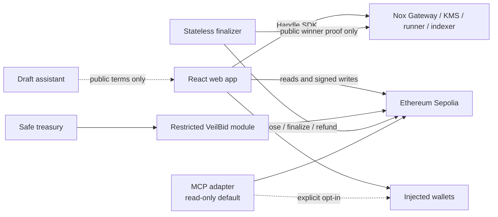
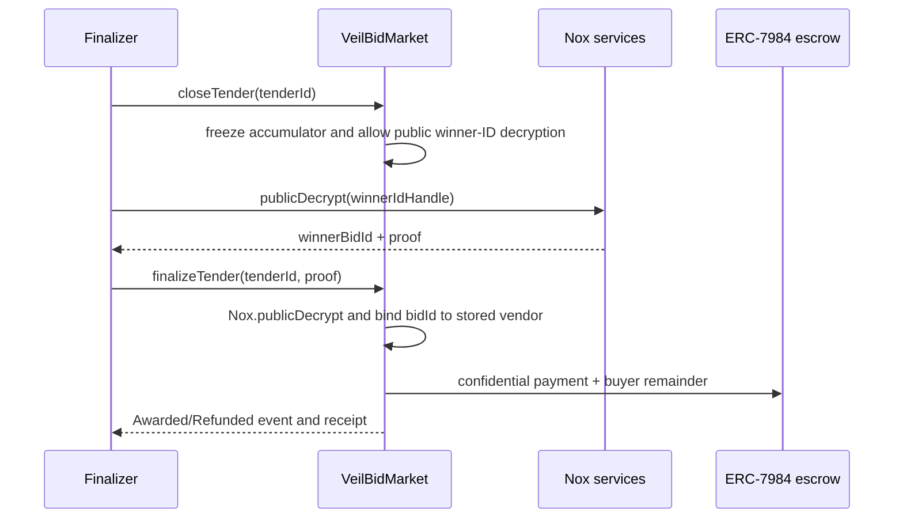

# VeilBid Architecture

> Status: Proposed architecture. Deployment addresses do not exist yet.

## 1. Architecture goals

- Achieve production-grade depth through independently designed contracts,
  applications, trust boundaries, recovery paths, and verification.
- Keep Nox in the decision and settlement path.
- Keep Safe as treasury owner and signing authority.
- Make public automation permissionless and stateless.
- Derive public application state from chain events.
- Provide private reveal only through Nox authorization.
- Make every delayed proof or indexing step recoverable.

## 2. System context



## 3. On-chain components

### `VeilBidMarket`

Canonical tender and bid state:

- Creates and funds tenders.
- Imports encrypted vendor prices.
- Maintains encrypted best price and winner ID.
- Controls lifecycle and terminal-state guards.
- Marks only winner ID publicly decryptable at close.
- Verifies the public-decryption proof at finalize.
- Coordinates confidential payout/refund.
- Grants scoped buyer/vendor/auditor ACL.

### `VeilBidEscrow`

Preferred only if Feasibility Gate D validates the split safely:

- Holds ERC-7984 budget balances.
- Accepts calls only from the canonical market.
- Pays the proof-derived winner using encrypted price.
- Returns encrypted remainder or full refund.
- Exposes no administrative withdrawal.

If cross-contract ACL adds unjustified risk, escrow remains internal to
`VeilBidMarket`. Architectural depth must not override correctness.

### `VeilBidSafeModule`

- Bound to one configured Safe.
- Allowlists market, escrow, token wrapper, NoxCompute, and selectors.
- Imports owner-created external handles.
- Grants persistent access only to the intended approved consumer and Safe.
- Routes reviewed Safe operations; cannot call arbitrary targets.
- Does not alter Safe owners, threshold, fallback handler, or guard.

### `VeilBidAwardReceipt`

- ERC-721 settlement receipt.
- Minted once per successfully awarded tender.
- Records public tender ID, buyer, winner, token, timestamps, and settlement
  transaction.
- Never embeds bid values or private handles in user-facing metadata.

### Demo asset contracts

- Faucet-backed Sepolia test USDC.
- Thin extension of official `ERC20ToERC7984Wrapper`.
- Assets have no monetary value.

## 4. Encrypted selection

Each stored bid has:

- Public bid ID and vendor.
- Encrypted price handle.
- Public submission block/time.
- Public lifecycle status.

Tender accumulator:

- `encryptedBestPrice`: initialized to encrypted `ceiling + 1`.
- `encryptedWinnerBidId`: initialized to encrypted zero.
- A new bid is converted to sentinel when zero or over ceiling.
- `Nox.lt` decides whether it is better.
- `Nox.select` updates price and bid ID together.
- Ties keep the earlier valid bid.

No contract function accepts a winner address as an independent decision input.

## 5. Two-phase finalization



Close and finalize are separate because public proof availability can lag the
mined close transaction. Activity stores the recoverable public request state.

## 6. Off-chain applications

### Web

- Wallet discovery and provider-specific reconnect.
- Public event index with bounded RPC ranges and finalized checkpoint.
- Buyer, Vendor, Public, Auditor, Activity, and Safe workspaces.
- Handle encryption/decryption, ACL views, and public proof recovery.
- Persistent progress UI for wallet, chain, indexing, proof, and refresh stages.

### Finalizer

- Stateless process with rebuildable local checkpoint.
- Reads public events/status only.
- Calls only permissionless close/finalize/refund functions.
- Simulates immediately before each write.
- Sequential writes and shared bounded action budget.
- Dry-run, one-shot, polling, structured logs, and health endpoint.
- Never logs handles, proofs, keys, or plaintext values.

### MCP

Planned public tools:

- List/get tenders.
- Explain lifecycle/readiness.
- Inspect public proof and receipt evidence.
- Draft public tender parameters.
- Inspect viewer ACL for a supplied handle.

Writes and private reveal are disabled by default and require an explicit signer
and opt-in environment flag.

### Strategy assistant

Optional and non-authoritative:

- Receives user-entered public tender intent only.
- Returns strict-schema draft metadata, ceiling, and deadlines.
- Does not receive wallet, bid, balance, handle, proof, signature, or key fields.
- Cannot choose a winner or submit a transaction.

## 7. Data and state ownership

| State | Canonical owner |
|---|---|
| Tender/bid lifecycle | Ethereum Sepolia contracts |
| Confidential values | Nox handles and ACL |
| Public lifecycle index | Rebuildable client/finalizer cache |
| Revealed plaintext | Browser session only |
| Safe authority | Safe owners and threshold |
| Deployment addresses/ABIs | Contract workspace canonical artifact |
| Assistant draft | Browser session only |

There is no application database or authentication server.

## 8. Failure and recovery

- RPC failure: preserve last finalized public checkpoint and show stale state.
- Nox indexing delay: bounded retry with explicit pending/retry state.
- Proof delay: persist closable proof request and resume without reclosing.
- Competing finalizer: reread status and simulate; treat stale race as benign.
- Wallet disconnect/network change: clear revealed plaintext and writes.
- Safe module revoked: public finalize/refund remains available; owner module
  actions pause.
- Assistant/MCP failure: never gates protocol settlement.

## 9. Planned repository structure

```text
tender-room/
auction-house/
settlement-relay/
operator-console/
chain-bindings/
evidence/
docs/
```

The names reflect VeilBid's procurement domain rather than generic application
and package buckets. Dependency rules and internal layouts are canonical in
`repository-layout.md`. Source directories are created only after the
feasibility and build-design gates.
