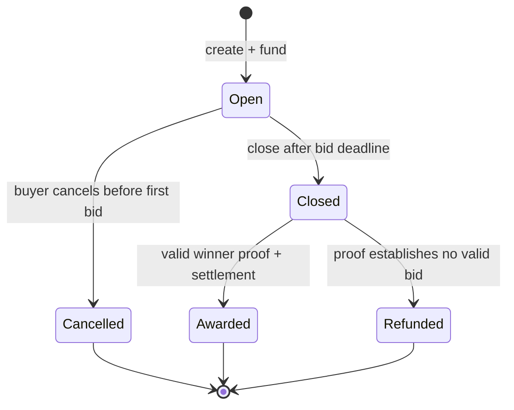

# Contract Specification

> Status: Pre-implementation specification; interfaces may change through a
> recorded architecture decision.

## 1. Domain types

### Tender

```text
buyer
paymentToken
metadataHash
publicCeiling
bidDeadline
status
bidCount
encryptedBudget
encryptedBestPrice
encryptedWinnerBidId
closeBlock
winnerBidId
winner
```

### Bid

```text
tenderId
vendor
encryptedPrice
submittedAt
status
```

## 2. Tender states



No transition leaves a terminal state.

## 3. Proposed external functions

### Market

- `createTender(...)`
- `createTenderAuthorized(...)`
- `submitBid(tenderId, encryptedPrice, proof)`
- `closeTender(tenderId)`
- `finalizeTender(tenderId, winnerBidId, winnerProof)`
- `cancelTender(tenderId)`
- `grantBidViewer(tenderId, bidId, viewer)`
- `getTender(tenderId)`
- `getBid(tenderId, bidId)`
- `canClose(tenderId)`
- `canFinalize(tenderId)`
- `canRefund(tenderId)`

### Safe module

- `prepareInput(encryptedInput, proof, consumer, actionHash, nonce)`
- `prepareInputs(encryptedInputs, proofs, consumers, actionHash, nonce)`
- no Safe execution function and no arbitrary `execute(address,bytes)`

Preparation requires a current owner of the configured Safe, an allowlisted
consumer, the intended action hash, and an unused nonce. Preparation alone
cannot call the Safe or transfer tokens. The prepared input is consumed once by
the intended market action inside a normal threshold-authorized Safe
transaction.

## 4. Validation

Public validation:

- Nonzero buyer/token and supported token.
- Ceiling within demo bounds.
- Bid deadline is in the future.
- One to eight unique, nonzero approved vendor addresses are fixed at creation.
- Only an approved vendor can submit, exactly once; bids are immutable.
- Escrow amount equals the public ceiling and is transferred atomically with
  tender creation.
- Ceiling fits the selected encrypted unsigned type and `ceiling + 1` cannot
  overflow.
- Only buyer can cancel before first bid.

Encrypted validation:

- Price is greater than zero.
- Price is less than or equal to public ceiling.
- Invalid values select the sentinel rather than reverting on private data.

## 5. Winner selection

For each bid:

1. Import price with target-bound proof.
2. Persist computation access for the market and viewer access for the vendor;
   do not automatically grant the buyer viewer access while `Open`.
3. Build encrypted public handles for zero, ceiling, sentinel, and bid ID.
4. Use nested `Nox.select` to map invalid price to sentinel.
5. Compare candidate with current encrypted best price.
6. Select both new best price and bid ID with the same encrypted condition.
7. Persist accumulator ACL for later transactions.

Do not emit validity or comparison result.

Viewer grants:

- Always target one stored bid handle; there is no tender-wide grant.
- The bid vendor may grant a nonzero viewer access to its own bid at any time.
- The tender buyer may grant a nonzero viewer only after the tender leaves
  `Open`.
- A Safe buyer must authorize the grant through a normal threshold-approved Safe
  transaction.
- The function cannot grant access to accumulator, budget, payment, or refund
  handles.
- Grants are irreversible for the current handle and emit `ViewerGranted`.

## 6. Close and finalize

`closeTender`:

- Requires `Open` and bid deadline passed.
- Freezes bid submissions.
- Stores close block/time.
- Marks only encrypted winner bid ID publicly decryptable.
- Changes status to `Closed`.

`finalizeTender`:

- Requires `Closed`.
- Verifies proof against the stored encrypted winner ID.
- Binds nonzero ID to a real bid in this tender.
- Uses stored vendor only; ignores caller-supplied addresses.
- Settles confidential winning price and remainder, or full refund for zero ID.
- Updates terminal status before external token callbacks.
- Mints one non-transferable receipt to the stored winning vendor only for
  `Awarded`, using a non-callback mint.

There is no timeout refund after close. A closed tender remains recoverable until
the Nox public-decryption proof becomes available. This intentionally favors
award fairness over fund liveness during a Nox outage.

## 7. Invariants

- Escrowed budget equals the public ceiling.
- Sum of confidential winner payment and buyer refund equals the public ceiling.
- At most one terminal settlement per tender.
- Winner is always the owner of the proof-derived bid ID.
- A zero/over-ceiling bid cannot be selected.
- A valid lower bid replaces a higher bid.
- Equal valid bids preserve deterministic first-submission priority.
- Only approved vendors have bid slots, and each can submit at most once.
- Public finalizers cannot cancel, change terms, or decrypt prices.
- Module preparation alone cannot transfer Safe funds.
- No module function can execute a transaction from the Safe.
- Award receipt ownership always equals the stored winning vendor; transfers and
  approvals are disabled.
- Contract source contains no plaintext bid mapping.

## 8. Events

Events expose public coordination only:

- `TenderCreated`
- `TenderFunded`
- `BidSubmitted`
- `TenderClosed`
- `TenderAwarded`
- `TenderRefunded`
- `TenderCancelled`
- `ViewerGranted`
- `AwardReceiptMinted`

Events may include encrypted handle fingerprints only when useful for proof
inspection. Logs and webhook payloads must not repeat complete proof bytes.

## 9. Reentrancy and external calls

- Use checks-effects-interactions and reentrancy guards on lifecycle writes.
- Update terminal state before ERC-7984 transfers.
- Canonical asset allowlist contains only reviewed wrappers.
- Receipt minting uses a non-callback mint so a contract vendor cannot block
  settlement. Transfer and approval entry points revert because the receipt is
  an immutable award record, not a tradable asset.

## 10. Upgrade and administration

Hackathon contracts should be non-upgradeable unless a concrete requirement
justifies upgradeability. Ownership must not provide an arbitrary withdrawal or
winner override. Admin capabilities and compromise impact must be documented.
