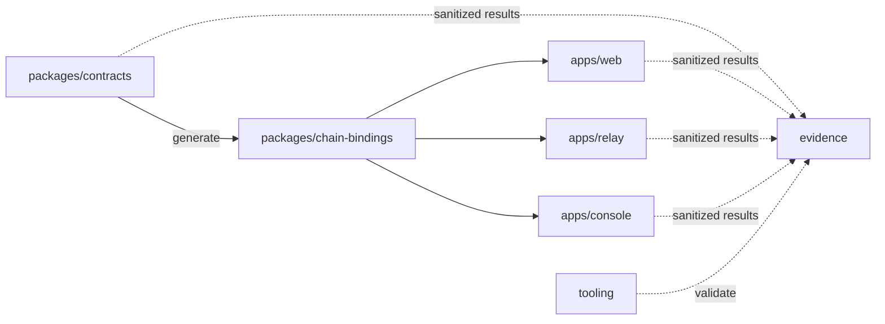

# VeilBid Repository Layout

> Status: Implemented canonical monorepo layout.

## 1. Top-level structure

```text
Veilbid/
├── apps/
│   ├── web/
│   │   ├── scripts/
│   │   ├── src/
│   │   └── test/
│   ├── relay/
│   │   ├── src/
│   │   └── test/
│   └── console/
│       ├── src/
│       └── test/
├── packages/
│   ├── contracts/
│   │   ├── contracts/
│   │   │   ├── market/
│   │   │   ├── safe/
│   │   │   ├── receipt/
│   │   │   ├── test-assets/
│   │   │   └── feasibility/
│   │   ├── test/
│   │   │   ├── unit/
│   │   │   ├── property/
│   │   │   ├── static/
│   │   │   ├── sepolia/
│   │   │   └── feasibility/
│   │   ├── scripts/
│   │   ├── verify/
│   │   └── deployments/
│   └── chain-bindings/
│       ├── generated/
│       ├── src/
│       └── test/
├── tooling/
│   └── scripts/
├── evidence/
│   ├── schemas/
│   ├── local/
│   └── sepolia/
├── docs/
│   └── original/
├── AGENTS.md
├── DESIGNS.md
├── PLAN.md
├── README.md
└── feedback.md
```

Generated directories such as `node_modules`, `dist`, `artifacts`, `cache`,
`.next`, and `.wrangler` are ignored and are not part of the canonical layout.

## 2. Workspace responsibilities

### `apps/web`

The browser product. It owns the landing page, documentation route, public
tender explorer, injected-wallet selection, Safe Buyer and advanced EOA forms,
Activity recovery, combined Private Bids disclosure, and Safe preparation
interface.

It reads canonical public state through `@veilbid/chain-bindings`; it does not
calculate or submit a plaintext winner.

### `apps/relay`

Stateless permissionless lifecycle automation. It discovers public readiness,
requests the public winner proof, simulates writes, and sequentially closes or
finalizes tenders. It contains no database or private reveal path.

### `apps/console`

Read-only local CLI and MCP integration. Exactly five public query tools are
implemented. It has no signer, write, custody, or decryption path.

### `packages/contracts`

The single Solidity and deployment workspace. It owns:

- Production Auction House contracts in `contracts/market`, `contracts/safe`,
  `contracts/receipt`, and `contracts/test-assets`.
- Isolated pre-build spike contracts in `contracts/feasibility`.
- Production unit, property, static, and Sepolia tests.
- Feasibility Gates A–E tests under `test/feasibility`.
- Hardhat/Nox configuration, deployment manifests, source publication, and
  deployment verification.

Feasibility sources share the pinned compiler and Nox toolchain but are never
production deployment inputs or consumer artifact sources.

### `packages/chain-bindings`

The generated boundary between contracts and runtime consumers. It contains
exact ABI/address snapshots, event codecs, public-index logic, readiness rules,
and shared domain types. Generated files are updated only by
`packages/contracts/scripts/generate-bindings.mjs`.

### `tooling`

Repository-wide maintenance scripts: preflight, sanitized evidence validation,
and current/full-history secret scanning. It contains no application runtime.

### `evidence`

Committed public-safe verification results. Confidential plaintext, encrypted
handles, proof bytes, signatures, and keys are forbidden. Private local output
belongs under ignored `.local/`.

## 3. Dependency direction



Rules:

- `packages/contracts` imports no other VeilBid workspace.
- `packages/chain-bindings` consumes generated artifacts but not contract
  runtime code.
- The three apps may depend on `packages/chain-bindings`; they do not depend on
  one another.
- Cross-workspace imports use package exports, not relative paths into another
  workspace’s `src`.
- Evidence is output, never runtime state.
- Circular dependencies are prohibited.

## 4. Canonical ownership

| Artifact | Canonical location |
|---|---|
| Production Solidity | `packages/contracts/contracts/{market,safe,receipt,test-assets}/` |
| Feasibility spike Solidity | `packages/contracts/contracts/feasibility/` |
| Production contract tests | `packages/contracts/test/{unit,property,static,sepolia}/` |
| Feasibility tests | `packages/contracts/test/feasibility/` |
| Deployment manifests | `packages/contracts/deployments/` |
| Consumer ABI/address snapshots | `packages/chain-bindings/generated/` |
| Public lifecycle indexing | `packages/chain-bindings/src/index/` |
| Browser session plaintext | `apps/web` memory only |
| Finalizer runtime | `apps/relay/` |
| MCP implementation | `apps/console/` |
| Repository verification tools | `tooling/scripts/` |
| Public verification artifacts | `evidence/` |
| Product/security/submission truth | `docs/` and root judge files |

## 5. Root orchestration

`pnpm-workspace.yaml` discovers deployable apps and reusable packages:

```yaml
packages:
  - apps/*
  - packages/*
```

Root scripts orchestrate workspace commands and repository tooling; application
logic remains inside the owning app or package.

Existing package identifiers such as `@veilbid/tender-room` and
`@veilbid/auction-house` remain stable for command and dependency compatibility.
They are logical package names, not top-level directory names.

## 6. Historical gate record

Feasibility originally ran in a standalone pre-build workspace. After Gates
A–E passed and production contracts were complete, both Solidity suites were
consolidated under `packages/contracts` to share one pinned toolchain. Their
source directories, test commands, deployment authority, and evidence roles
remain explicitly separated.
