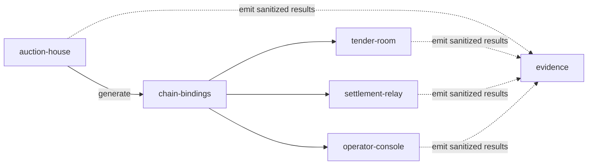

# VeilBid Repository Layout

> Status: Canonical planned source layout. Source workspaces do not exist until
> their phase gate permits scaffolding.

## 1. Top-level structure

```text
Veilbid/
├── feasibility/
│   ├── contracts/
│   ├── test/
│   ├── scripts/
│   └── README.md
├── tender-room/
│   ├── public/
│   ├── src/
│   │   ├── buyer/
│   │   ├── vendor/
│   │   ├── public-market/
│   │   ├── auditor/
│   │   ├── safe-treasury/
│   │   ├── activity/
│   │   └── shell/
│   └── tests/
├── auction-house/
│   ├── contracts/
│   │   ├── market/
│   │   ├── custody/
│   │   ├── safe/
│   │   ├── receipt/
│   │   └── test-assets/
│   ├── test/
│   │   ├── unit/
│   │   ├── invariant/
│   │   ├── nox-runtime/
│   │   └── sepolia/
│   ├── deploy/
│   ├── verify/
│   └── deployments/
├── settlement-relay/
│   └── src/
│       ├── discovery/
│       ├── decisions/
│       ├── proofs/
│       ├── transactions/
│       └── health/
├── operator-console/
│   └── src/
│       ├── mcp/
│       ├── commands/
│       ├── policies/
│       └── signer/
├── chain-bindings/
│   ├── generated/
│   └── src/
│       ├── addresses/
│       ├── events/
│       ├── index/
│       ├── readiness/
│       └── domain/
├── evidence/
│   ├── schemas/
│   ├── local/
│   └── sepolia/
├── docs/
│   └── original/
├── AGENTS.md
├── DESIGNS.md
├── PLAN.md
├── README.md
└── feedback.md
```

## 2. Workspace responsibilities

### `feasibility`

The only pre-build source workspace. It owns minimal contracts, tests, and
scripts for Feasibility Gates A–E. It may be created after Product Plan approval
and before production workspaces exist.

It is not a product runtime package, deployment authority, or source of
canonical consumer artifacts. Reusable findings must be reimplemented or
deliberately migrated into `auction-house` after the gates pass and the
architecture is selected.

### `tender-room`

The only browser product. It owns presentation, route state, injected-wallet
selection, Handle SDK authorization, session-only plaintext, responsive
interaction, and the public tender explorer.

It does not own canonical lifecycle state and cannot calculate or submit a
winner.

### `auction-house`

The only Solidity and deployment authority. It owns protocol contracts,
Hardhat configuration, fixtures, invariants, deployment scripts, source
verification, and canonical deployment JSON.

It never imports frontend or automation code.

### `settlement-relay`

Permissionless lifecycle automation. It discovers public readiness, requests
public winner proofs, simulates writes, and sequentially calls close, finalize,
or refund.

It contains no private reveal path and no database.

### `operator-console`

Local CLI and MCP integration. Public tools are enabled by default. Decryption
and writes require an explicit signer plus opt-in policy. Signer code is isolated
under `src/signer/` so secret-bearing paths are easy to audit.

### `chain-bindings`

Generated boundary between on-chain deployment and consumers. It contains:

- Exact ABI snapshots.
- Chain/address manifests.
- Event decoders and lifecycle normalization.
- Rebuildable public index logic.
- Readiness and domain types shared by the browser, relay, and console.

Generated files are updated only from `auction-house`.

### `evidence`

Committed evidence is sanitized and schema-validated. Confidential plaintext,
handles, proofs, signatures, and keys are forbidden. Local private artifacts go
under ignored `.local/`, not here.

## 3. Dependency direction



Rules:

- `auction-house` depends on no other workspace.
- `chain-bindings` consumes generated contract artifacts but never imports
  runtime code from `auction-house`.
- `tender-room`, `settlement-relay`, and `operator-console` may depend on
  `chain-bindings`; they do not depend on each other.
- `evidence` is output, never a runtime source of truth.
- Cross-workspace imports use published package entry points, not relative paths
  into another workspace's `src/`.
- Circular dependencies are prohibited.

## 4. Canonical ownership

| Artifact | Canonical location |
|---|---|
| Pre-build spike source and tests | `feasibility/` |
| Solidity source and tests | `auction-house/` |
| Deployment addresses and transactions | `auction-house/deployments/` |
| Consumer ABIs and addresses | `chain-bindings/generated/` |
| Public lifecycle indexing | `chain-bindings/src/index/` |
| Browser session plaintext | `tender-room` memory only |
| Finalizer checkpoint | Local ignored relay runtime file |
| MCP signer | Environment-only configuration |
| Public verification artifacts | `evidence/` |
| Product/security/submission truth | `docs/` and root judge files |

## 5. Root orchestration

During feasibility, the root workspace list contains only `feasibility`.
Production workspaces are added after the scaffolding gate and retain their
domain names:

```json
{
  "workspaces": [
    "tender-room",
    "auction-house",
    "settlement-relay",
    "operator-console",
    "chain-bindings"
  ]
}
```

Root scripts orchestrate builds; they do not contain application logic.

## 6. Scaffolding gate

Create `feasibility/` only after:

1. Product Plan approval.

Create `tender-room/`, `auction-house/`, `settlement-relay/`,
`operator-console/`, and `chain-bindings/` only after:

1. Feasibility Gates A–D pass.
2. Gate D decides whether custody is internal to the market or a separate
   contract.
3. Build Plan approval records the tested package versions and selected
   architecture.

Gate E may continue in `feasibility/` while core production scaffolding begins,
but the Safe-owned product path cannot be called complete until Gate E passes.
